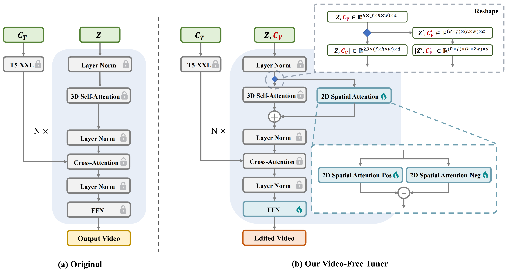

# 🚀 ViFeEdit: A Video-Free Tuner of Your Video Diffusion Transformer


<a href="https://github.com/Lexie-YU/ViFeEdit"></a> 

> **ViFeEdit: A Video-Free Tuner of Your Video Diffusion Transformer**
> <br>
> [Ruonan Yu](https://scholar.google.com/citations?user=UHP95egAAAAJ&hl=en), 
> [Zhenxiong Tan](https://scholar.google.com/citations?user=HP9Be6UAAAAJ&hl=en),
> [Zigeng Chen](https://czg1225.github.io/chenzigeng99/),
> [Songhua Liu*](https://huage001.github.io/),
> [Xinchao Wang*](https://sites.google.com/site/sitexinchaowang/)
> <br>
> [xML Lab](https://sites.google.com/view/xml-nus), National University of Singapore; Shanghai Jiao Tong University
> <br>

## 🪶Features

* 🎬 The first method that adapts text-to-video DiTs to diverse video editing tasks in a **video-free scheme**.
* **Easy Training 🚀**: With only 100-250 image paired data and minimal computational cost (< 20 epochs), ViFeEdit achieves promising performance across a wide range of video editing tasks.

## 🔥News
**[2026/03/17]** We release codes for both training and inference of ViFeEdit.

## Introduction

<br>

Diffusion Transformers (DiTs) have demonstrated remarkable scalability and quality in image and video generation, prompting growing interest in extending them to controllable generation and editing tasks. However, compared to the image counterparts, progress in video control and editing remains limited, mainly due to the scarcity of paired video data and the high computational cost of training video diffusion models. To address this issue, in this paper, we propose a video-free tuning framework termed **ViFeEdit** for video diffusion transformers. Without requiring any forms of video training data, ViFeEdit achieves versatile video generation and editing, **adapted solely with 2D images**. At the core of our approach is an architectural reparameterization that decouples spatial independence from the full 3D attention in modern video diffusion transformers, which enables visually faithful editing while maintaining temporal consistency with only minimal additional parameters. Moreover, this design operates in a dual-path pipeline with separate timestep embeddings for noise scheduling, exhibiting strong adaptability to diverse conditioning signals. Extensive experiments demonstrate that our method delivers promising results of controllable video generation and editing with only minimal training on 2D image data.


<br>


## Installation

* Clone this repo to your project directory:

  ``` bash
  git clone https://github.com/Lexie-YU/ViFeEdit.git
  cd ViFeEdit
  pip install -e .
  ```
* If you already have a DiffSynth Conda environment, you can reuse it. If you encounter ModuleNotFoundError: No module named 'pkg_resources', try using `pip install -e . --no-build-isolation` instead, and ViFeEdit is evaluated under `transformers==4.55.0`.


## Training

1. Prepare training data.

  * For consistent style transfer task, we adopt the open-source image dataset [OmniConsistency](https://huggingface.co/datasets/showlab/OmniConsistency), which contains 100-200 paired samples for each style.

  * For other editing tasks, we adopt GPT-5 to randomly generate prompts for editing tasks and then adopt [FLUX.1-dev](https://huggingface.co/black-forest-labs/FLUX.1-dev) to generate the source images and [Qwen-Image-Edit-2509](https://huggingface.co/Qwen/Qwen-Image-Edit-2509) to generate the corresponding target edited images. Each task consists of 250 paired samples.

  * The training data folder should be organized to the following format:

     ```
     train_data
     ├── src_0.png
     ├── tar_0.png
     ├── src_1.png
     ├── tar_1.png
     ├── ...
     ├── metadata_vife.csv
     ```

    `metadata_vife.csv` is the metadata list, for example:
    ```
    video,prompt,vife_edit_video
    tar_001.png,"3D Chibi style, a cute dog is running on the grass.",src_001.png
    ```
    Here, the `video` is for the edited video, and `vife_edit_video` is for the source video, and `prompt` is the target prompt.

   
2. Let's start training! Make sure to modify `train_vife.sh` and configure the training data folder, output folder.

   ```bash
   bash train_vife.sh
   ```
    Here, num_epochs is set to 500, but in practice we only use the first 20 epochs, i.e., you may stop training at epoch 20.

## Inference

* You can simply use the following example for inference:
  ```bash
  python inference.py
  ```
  You can also try postprocess.py for better alignment.

## Acknowledgement

* [Wan](https://github.com/Wan-Video/Wan2.1) for the source models.
* [DiffSynth-Studio](https://github.com/modelscope/DiffSynth-Studio) for the code base.
* [OmniConsistency](https://huggingface.co/datasets/showlab/OmniConsistency) for consistent style transfer task training dataset and [FLUX.1-dev](https://huggingface.co/black-forest-labs/FLUX.1-dev) and [Qwen-Image-Edit-2509](https://huggingface.co/Qwen/Qwen-Image-Edit-2509) for other editing task training dataset generation.

## Citation

If you finds this repo is helpful, please consider citing:

```bib

```
